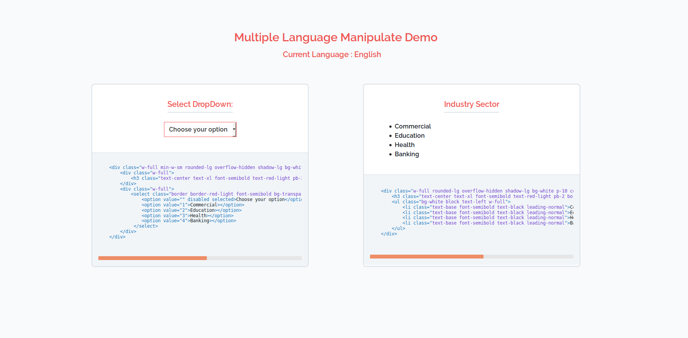
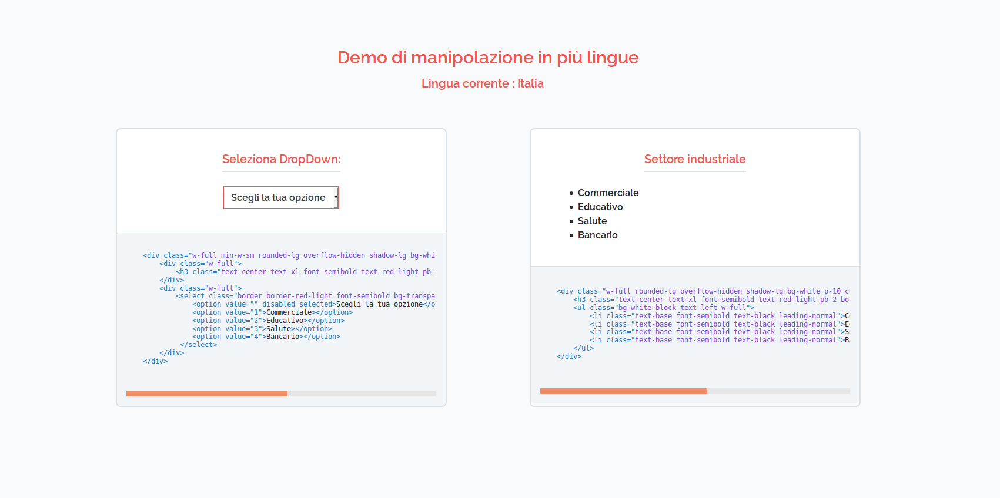
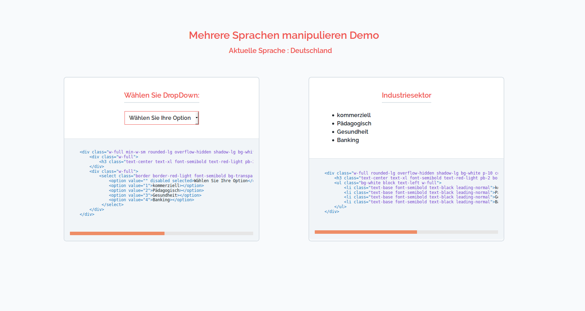

## Multi Language Manipulate Demo

## Introduction
This application helps to manipulate labels, dropdown values, string, content on the basis of language change.Values will be display automatically from the database or language files using helpers. 

## Installation

Please check the official laravel installation guide for server requirements before you start. [Official Documentation](https://laravel.com/docs/5.6/installation#installation)

Clone the repository

    git clone https://github.com/viitorcloudtechnologies/multiple-language-manipulate.git
    
Switch to the repo folder

    cd multiple-language-manipulate
    
If you have linux system, you can execute below command only in your project root
    
    1) sudo chmod -R 777 install.sh
    2) ./install.sh
    
If you have windows system, you can run Artisan Command for database setup, connection and configuration.
    
    php artisan install:app
    
Please add proper information while performing above command.

or you can setup manually using below command

Run the database migrations and seeder(**Set the database connection in .env before migrating**)

    php artisan migrate
    
    php artisan db:seed

Default languages in this application
    
    en :- English (By default)
    it :- Italy
    gr :- Germany

Start the local development server

    php artisan serve
    
    http:://127.0.0.1::[your_port] (By default english lang loaded)
    
    http:://127.0.0.1::[your_port]/it (For italy)
    
    http:://127.0.0.1::[your_port]/gr (For germany)
    
   
## Kye points before using this feature
    
    Please check composer.json file in which you have to define 'helpers.php' file and 'database' folder path.
    
    Review config/config-variables.php file.
    
    Review config/table-variables.php file.
    
    Review resources/lang folder.
    
    Review migrations of 'industry sector' which contain langauge specific column. 

## Application contain example
```
In this application you will find 'industry sector' model, migration and seeder.
You can review this industry sector demo and check each helpers functions.
```
## Helper functions

`dbTrans` function used to fetch language specific column from the table.
    
```php
if (!function_exists('dbTrans')) {

    /**
     * @param string $lang
     * @param string $tableName
     * @return string
     */
    function dbTrans(string $lang, string $tableName)
    {
        return $lang.'_'.config('table-variables.field_post_fix.'.$tableName);
    }
}
```

`pluckDBTrans` function used to fetch values of language specific column from the table.
    
```php
if (!function_exists('pluckDBTrans')) {

    /**
     * @param $query
     * @param string $fieldName
     * @return mixed
     */
    function pluckDBTrans($query, string $fieldName)
    {
        return $query->where($fieldName, '!=', null)
            ->pluck($fieldName, 'id')
            ->toArray();
    }
}
```

`labelManipulate` function used to display value of specific key from language files on the basis of selected language.
    
```php
if (!function_exists('labelManipulate')) {

    /**
     * @param string $configFileName
     * @param string $key
     * @return array|bool|\Illuminate\Contracts\Translation\Translator|null|string
     */
    function labelManipulate(string $configFileName,string $key)
    {
        try {
            return trans($configFileName.'.'.$key);
        } catch (\Exception $ex) {
            return false;
        }
    }
}
```
## ScreenShots

## English Language


## Italy Language


## Germany Language


## Contributing
Feel free to create any pull requests for the project. For proposing any new changes or features you want to add to the project, you can send us an email at vishal@viitorcloud.com or ruchit.patel@viitorcloud.com

## Issues

If you come across any issues please report them [here](https://github.com/viitorcloudtechnologies/multiple-language-manipulate/issues).

## Authors
* [**Ruchit Patel**](https://github.com/ruchit-viitorcloud)

## Special Thanks to
* [**Sahil Darji**](https://github.com/vc-sahil)
* [**Dhara_Tank**](https://github.com/dhara-viitorcloud)
* [Laravel](https://laravel.com) Community

## License
[MIT LICENSE](https://github.com/viitorcloudtechnologies/multiple-language-manipulate/blob/master/LICENSE)
